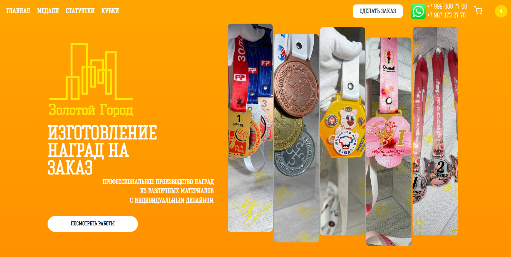
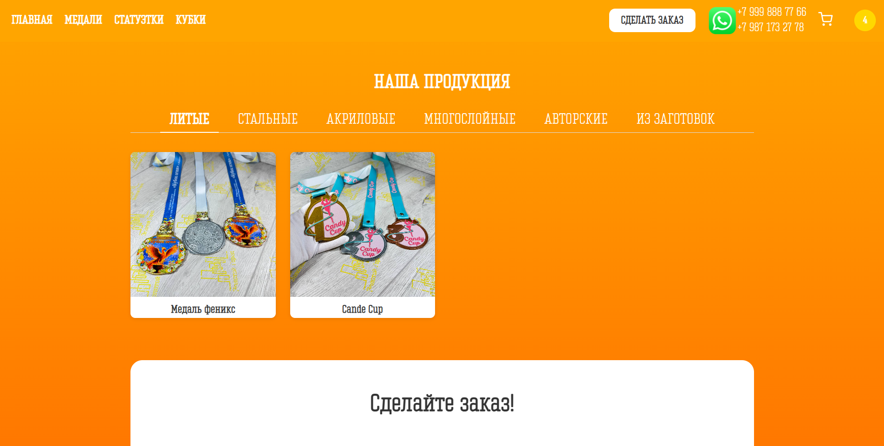

# 🏅 Medalki — интернет-магазин наградной продукции

Веб-приложение для продажи наградной продукции с клиентской и серверной частью.

## 🚀 Функциональность

- Просмотр каталога товаров
- Добавление товаров в корзину
- Обработка заказов
- Взаимодействие с базой данных
- REST API между frontend и backend

## 🛠️ Технологии

**Frontend:**
- React
- JavaScript

**Backend:**
- Node.js

**База данных:**
- MySQL

## 🏗️ Архитектура

Проект состоит из:
- клиентской части (React)
- серверной части (Node.js)
- базы данных MySQL

## 📸 Скриншоты

(сюда добавишь скрины — покажу как ниже)

## ⚙️ Установка и запуск

### 1. Клонировать репозиторий
```bash
git clone https://github.com/LASTumber/medalki.git
cd medalki
```

### 2. Установить зависимости
```bash
npm install
```

### 3. Запустить проект
```bash
npm start
```

## 📌 Что я прокачал в этом проекте

- Разработка fullstack приложения
- Работа с REST API
- Интеграция frontend и backend
- Работа с базой данных MySQL

## 📸 Скриншоты


